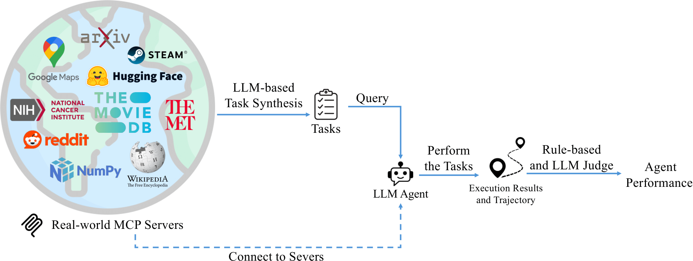

# MCP-Bench: Benchmarking Tool-Using LLM Agents with Complex Real-World Tasks via MCP Servers

[](https://arxiv.org/abs/2508.20453)
[](https://opensource.org/licenses/Apache-2.0)
[](https://www.python.org/downloads/)
[](https://github.com/anthropics/mcp)



## Overview

MCP-Bench is a comprehensive evaluation framework designed to assess Large Language Models' (LLMs) capabilities in tool-use scenarios through the Model Context Protocol (MCP). This benchmark provides an end-to-end pipeline for evaluating how effectively different LLMs can discover, select, and utilize tools to solve real-world tasks.

## Quick Start

### Installation

1. **Clone the repository**
```bash
git clone https://github.com/accenture/mcp-bench.git
cd mcp-bench
```

2. **Install dependencies**
```bash
conda create -n mcpbench python=3.10
cd mcp_servers
# Install MCP server dependencies
bash ./install.sh
cd ..
```

3. **Set up environment variables**
```bash
# Create .env file with API keys
# Default setup uses both OpenRouter and Azure OpenAI
# For Azure OpenAI, you also need to set your API version in file benchmark_config.yaml (line205)
# For OpenRouter-only setup, see "Optional: Using only OpenRouter API" section below
cat > .env << EOF
OPENROUTER_API_KEY=your_openrouterkey_here
AZURE_OPENAI_API_KEY=your_azureopenai_apikey_here
AZURE_OPENAI_ENDPOINT=your_azureopenai_endpoint_here
EOF
```

4. **Configure MCP Server API Keys**

Some MCP servers require external API keys to function properly. These keys are automatically loaded from `./mcp_servers/api_key`. You should set these keys by yourself in file `./mcp_servers/api_key`:

```bash
# View configured API keys
cat ./mcp_servers/api_key
```

Required API keys include (These API keys are free and easy to get. You can get all of them within 10 mins):
- `NPS_API_KEY`: National Park Service API key (for nationalparks server) - [Get API key](https://www.nps.gov/subjects/developer/get-started.htm)
- `NASA_API_KEY`: NASA Open Data API key (for nasa-mcp server) - [Get API key](https://api.nasa.gov/)
- `HF_TOKEN`: Hugging Face token (for huggingface-mcp-server) - [Get token](https://huggingface.co/docs/hub/security-tokens)
- `GOOGLE_MAPS_API_KEY`: Google Maps API key (for mcp-google-map server) - [Get API key](https://developers.google.com/maps)
- `NCI_API_KEY`: National Cancer Institute API key (for biomcp server) - [Get API key](https://clinicaltrialsapi.cancer.gov/)


### Basic Usage

```bash
# 1. Verify all MCP servers can be connected
python ./utils/collect_mcp_info.py

# 2. List available models
source .env
python run_benchmark.py --list-models \
--tasks-file tasks/mcpbench_tasks_single_runner_format.json

# 3. Run benchmark (gpt-oss-20b as an example)
## run all tasks
source .env
python run_benchmark.py --models gpt-oss-20b

## single server tasks
source .env
python run_benchmark.py --models gpt-oss-20b \
--tasks-file tasks/mcpbench_tasks_single_runner_format.json

## two server tasks
source .env
python run_benchmark.py --models gpt-oss-20b \
--tasks-file tasks/mcpbench_tasks_multi_2server_runner_format.json

## three server tasks
source .env
python run_benchmark.py --models gpt-oss-20b \
--tasks-file tasks/mcpbench_tasks_multi_3server_runner_format.json

```

### Optional: Add other model providers

To add new models from OpenRouter:

1. **Find your model on OpenRouter**
   - Visit [OpenRouter Models](https://openrouter.ai/models) to browse available models
   - Copy the model ID (e.g., `anthropic/claude-sonnet-4` or `meta-llama/llama-3.3-70b-instruct`)

2. **Add the model configuration**
   - Edit `llm/factory.py` and add your model in the OpenRouter section (around line 152)
   - Follow this pattern:
   ```python
   configs["your-model-name"] = ModelConfig(
       name="your-model-name",
       provider_type="openrouter",
       api_key=os.getenv("OPENROUTER_API_KEY"),
       base_url="https://openrouter.ai/api/v1",
       model_name="provider/model-id"  # The exact model ID from OpenRouter
   )
   ```

3. **Verify the model is available**
   ```bash
   source .env
   python run_benchmark.py --list-models
   # Your new model should appear in the list
   ```

4. **Run benchmark with your model**
   ```bash
   source .env
   python run_benchmark.py --models your-model-name
   ```

### Optional: Using only OpenRouter API

If you only want to use OpenRouter without Azure:

1. **Set up .env file with only OpenRouter:**
```bash
cat > .env << EOF
OPENROUTER_API_KEY=your_openrouterkey_here
EOF
```

2. **Modify the code to access Azure models through OpenRouter:**

Edit `llm/factory.py` and comment out the Azure section (lines 69-101), then add Azure models through OpenRouter instead:

```python
# Comment out or remove the Azure section (lines 69-109)
# if os.getenv("AZURE_OPENAI_API_KEY") and os.getenv("AZURE_OPENAI_ENDPOINT"):
#     configs["o4-mini"] = ModelConfig(...)
#     ...

# Add Azure models through OpenRouter (in the OpenRouter section around line 106)
if os.getenv("OPENROUTER_API_KEY"):
    # Add OpenAI models via OpenRouter
    configs["gpt-4o"] = ModelConfig(
        name="gpt-4o",
        provider_type="openrouter",
        api_key=os.getenv("OPENROUTER_API_KEY"),
        base_url="https://openrouter.ai/api/v1",
        model_name="openai/gpt-4o"
    )
    
    configs["gpt-4o-mini"] = ModelConfig(
        name="gpt-4o-mini",
        provider_type="openrouter",
        api_key=os.getenv("OPENROUTER_API_KEY"),
        base_url="https://openrouter.ai/api/v1",
        model_name="openai/gpt-4o-mini"
    )
    
    configs["o3"] = ModelConfig(
        name="o3",
        provider_type="openrouter",
        api_key=os.getenv("OPENROUTER_API_KEY"),
        base_url="https://openrouter.ai/api/v1",
        model_name="openai/o3"
    )
    
    configs["o4-mini"] = ModelConfig(
        name="o4-mini",
        provider_type="openrouter",
        api_key=os.getenv("OPENROUTER_API_KEY"),
        base_url="https://openrouter.ai/api/v1",
        model_name="openai/o4-mini"
    )

    configs["gpt-5"] = ModelConfig(
        name="gpt-5",
        provider_type="openrouter",
        api_key=os.getenv("OPENROUTER_API_KEY"),
        base_url="https://openrouter.ai/api/v1",
        model_name="openai/gpt-5"
    )
    
    
    # Keep existing OpenRouter models...
```

This way all models will be accessed through OpenRouter's unified API.


## MCP Servers

MCP-Bench includes 28 diverse MCP servers:

- [BioMCP](https://github.com/ckreutzer/biomcp) - Biomedical research data, clinical trials, and health information
- [Bibliomantic](https://github.com/Fardin-Data/bibliomantic-mcp-server) - I Ching divination, hexagrams, and mystical guidance
- [Call for Papers](https://github.com/shawnchen03/call-for-papers-mcp) - Academic conference submissions and call announcements
- [Car Price Evaluator](https://github.com/aryamanpandya99/car-price-mcp) - Vehicle valuation and automotive market analysis
- [Context7](https://github.com/3cn-ecn/context7-mcp) - Project context management and documentation services
- [DEX Paprika](https://github.com/suekou/dexpaprika-mcp) - Cryptocurrency DeFi analytics and decentralized exchange data
- [FruityVice](https://github.com/anthonyprawira/fruityvice-mcp) - Comprehensive fruit nutrition information and dietary data
- [Game Trends](https://github.com/StefanMaran/game-trends-mcp) - Gaming industry statistics and trend analysis
- [Google Maps](https://github.com/wknd24/mcp-google-map) - Location services, geocoding, and mapping functionality
- [Huge Icons](https://github.com/stocai/hugeicons-mcp-server) - Icon search, management, and design resources
- [Hugging Face](https://github.com/smartagentcom/huggingface-mcp-server) - Machine learning models, datasets, and AI capabilities
- [Math MCP](https://github.com/SaintMiner/math-mcp) - Mathematical calculations and computational operations
- [Medical Calculator](https://github.com/cdrcx/MedCalc-bench/tree/main/MedCalcBench) - Clinical calculation tools and medical formulas
- [Metropolitan Museum](https://github.com/ahochman/metmuseum-mcp) - Art collection database and museum information
- [Movie Recommender](https://github.com/abhinavchadha/movie-recommender-mcp) - Film recommendations and movie metadata
- [NASA Data](https://github.com/ianryan/nasa-mcp) - Space mission data and astronomical information
- [National Parks](https://github.com/geobio/mcp-server-nationalparks) - US National Parks information and visitor services
- [NixOS](https://github.com/pico-lab/mcp-nixos-search) - Package management and system configuration tools
- [OKX Exchange](https://github.com/JaminLiu/okx-mcp) - Cryptocurrency trading data and market information
- [OpenAPI Explorer](https://github.com/hharasaki/openapi-mcp-server) - API specification exploration and testing tools
- [OSINT Intelligence](https://github.com/fybits/osint-mcp) - Open source intelligence gathering and analysis
- [Paper Search](https://github.com/shaneholloman/paper-search-mcp) - Academic paper search across multiple research databases
- [Reddit](https://github.com/modelcontextprotocol/servers/tree/main/src/reddit) - Social media content and community discussions
- [Scientific Computing](https://github.com/Srivatzn/scientific_computation_mcp) - Advanced mathematical computations and data analysis
- [Time MCP](https://github.com/modelcontextprotocol/servers/tree/main/src/time) - Date, time utilities, and timezone conversions
- [Unit Converter](https://github.com/modelcontextprotocol/servers/tree/main/src/unit-converter) - Measurement conversions across different unit systems
- [Weather Data](https://github.com/thrillee/weather_mcp) - Weather forecasts and meteorological information
- [Wikipedia](https://github.com/modelcontextprotocol/servers/tree/main/src/wikipedia) - Encyclopedia content search and retrieval

## Project Structure

```
MCP-Benchmark/
├── agent/                     # Task execution agents
│   ├── executor.py           # Multi-round task executor with retry logic
│   └── execution_context.py  # Execution context management
├── benchmark/                 # Evaluation framework
│   ├── evaluator.py          # LLM-as-judge evaluation metrics
│   ├── runner.py             # Benchmark orchestrator
│   ├── results_aggregator.py # Results aggregation and statistics
│   └── results_formatter.py  # Results formatting and display
├── config/                    # Configuration management
│   ├── benchmark_config.yaml # Benchmark configuration
│   └── config_loader.py      # Configuration loader
├── llm/                       # LLM provider abstractions
│   ├── factory.py            # Model factory for multiple providers
│   └── provider.py           # Unified provider interface
├── mcp_modules/              # MCP server management
│   ├── connector.py          # Server connection handling
│   ├── server_manager.py     # Multi-server orchestration
│   └── server_manager_persistent.py # Persistent connection manager
├── synthesis/                # Task generation
│   ├── task_synthesis.py     # Task generation with fuzzy conversion
│   ├── generate_benchmark_tasks.py # Batch task generation
│   ├── benchmark_generator.py # Unified benchmark task generator
│   └── split_combinations/   # Server combination splits
├── utils/                    # Utilities
│   ├── collect_mcp_info.py  # Server discovery and tool collection
│   ├── local_server_config.py # Local server configuration
│   └── error_handler.py     # Error handling utilities
├── tasks/                    # Benchmark task files
│   ├── mcpbench_tasks_single_runner_format.json
│   ├── mcpbench_tasks_multi_2server_runner_format.json
│   ├── mcpbench_tasks_multi_3server_runner_format.json
│   └── mcpbench_tasks_multi_4plus_server_runner_format.json
├── mcp_servers/             # MCP server implementations (28 servers)
│   ├── commands.json        # Server command configurations
│   ├── install.sh          # Installation script for all servers
│   ├── requirements.txt    # Python dependencies
│   └── [28 server directories]
├── run_benchmark.py         # Main benchmark runner script
└── README.md               # Project documentation
```

## Citation

If you use MCP-Bench in your research, please cite:

```bibtex
@article{wang2025mcpbench,
  title={MCP-Bench: Benchmarking Tool-Using LLM Agents with Complex Real-World Tasks via MCP Servers},
  author={Wang, Zhenting and Chang, Qi and Patel, Hemani and Biju, Shashank and Wu, Cheng-En and Liu, Quan and Ding, Aolin and Rezazadeh, Alireza and Shah, Ankit and Bao, Yujia and Siow, Eugene},
  journal={arXiv preprint arXiv:2508.20453},
  year={2025}
}
```

## Acknowledgments

- Built on the [Model Context Protocol](https://github.com/anthropics/mcp) by Anthropic
- Thanks to all open-sourced MCP servers implemetation used
